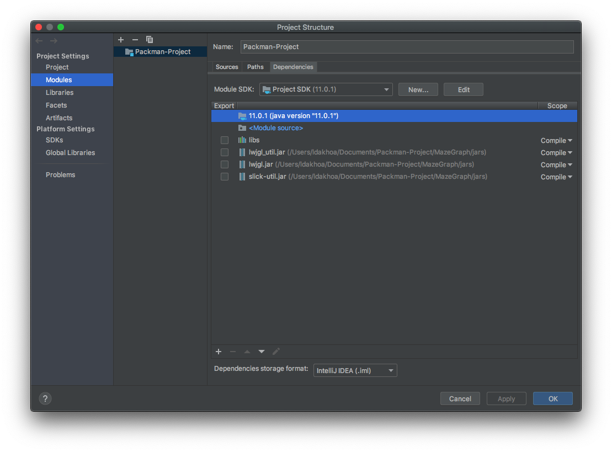

# Packman-Project

## Project for Datastructure and Algorithm class

Use java11.0.1.

### Usage:
**Download:** 
```git clone https://github.com/thanhvang99/Packman-Project.git```

**Open in intellij**:

1. Right click **/src** -> **Mark Directory as** -> **Resources Root**
2. **Run** -> **Edit Configurations...** and VM options: `-Djava.library.path=libs/` or you can Edit your config like:


3. Apply -> OK
4. Open Project structure: **File** -> **Project Structure...**
5. In **Project Settings** tab -> **Project** -> **Project compiler output**: choose /out to compile your test

6. In **Libraries** -> Click add button choose /libs

7. In **Modules** -> **Dependencies** -> Click add button and addaall file in sjars

